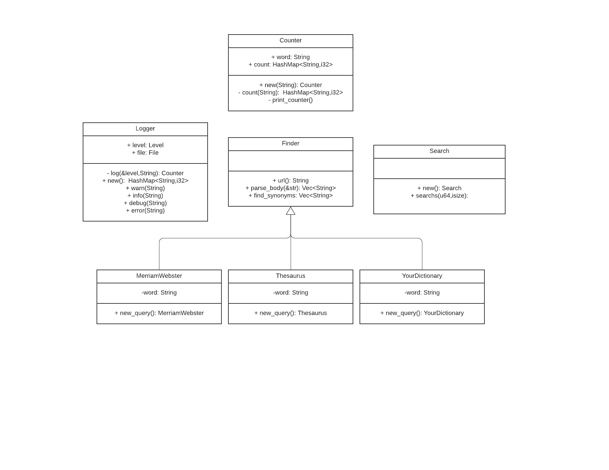
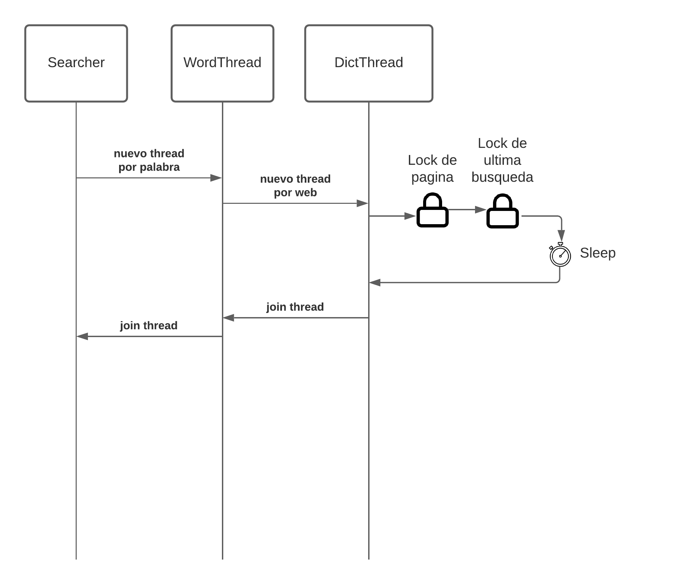
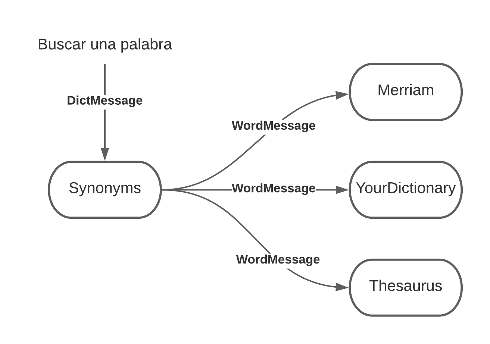

# TP2 - Buscador de Sinónimos Rústico
 
## Integrantes
**Fecha de entrega:** 29 de junio antes de las 19 hs.
 
- Daneri, Alejandro
- Lafroce, Matias

## Ejecución
El presente trabajo práctico tiene como objetivo implementar un software buscador de sinónimos de palabras.
 
El programa recibe 3 parámetros de entrada:
Para ello se realizarán peticiones de varios sitios de Internet que ofrecen este servicio.
 
- **file**: nombre del archivo que contiene las palabras a buscar
- **max_conc_reqs**: cantidad máxima de requests HTTP a procesar en forma concurrente para todos los sitios
- **page_cooldown**: tiempo mínimo de espera entre dos requests HTTP sucesivos para un mismo sitio

## Requerimientos Funcionales
 
A su vez se debe especificar que binario se quiere generar, teniendo dos opciones: actores y sinonimos. Por ejemplo:
Se debe implementar un software para ser ejecutado en la consola de comandos que busque sinónimos de palabras en distintos sitios de Internet.

Para ejecutar la busqueda utilizando modelo de actores, ejecutar el siguiente comando para llamar al binario `actores`

```bash
cargo run --bin actores words.txt <cooldown> <n_reqs> 
```

Donde <cooldown> es el tiempo entre requests en segundos y <n_reqs> es la cantidad máxima de requests

Por ejemplo, en la siguiente ejecución se buscan las palabras del archivo `words.txt` utilizando 5 segundos entre requests y 2 requests concurrentes

```bash
cargo run --bin actores words.txt 5 2
```

Para ejecutar la búsqueda utilizando el modelo de hilos, utilizamos el binario `sinonimos`, con los mismo parámetros

```bash
cargo run --bin sinonimos words.txt 5 2
```


## Estructuras y Traits utilizados

En el módulo `synonym` tenemos el trait `Finder` y el error custom `FinderError`. El trait `Finder ` posee la interfaz común a los buscadores de sinónimos. Estos buscadores poseen una URL a la cuál se hace el request HTTP en busca de sinónimos. El método `get_url()` es para obtener la url particular del buscador, y `parse_body()` para extraer los sinónimos de la respuesta.

El trait `Finder` implementa el método `find_synonyms`, que ejecuta el request y parsea la respuesta, devolviendo los sinónimos parseados.




### Parte A: threads



Para la parte A  tenemos una estructura importante: Searcher.

Searcher tiene el vector de palabras a buscar y un vector con CondVars por cada instancia de Finder.

El método `searchs` instancia además un SystemTime compartido por cada finder instanciado (Posibilidad de mejora: hacer una estructura que contenga este timestamp junto al finder). Este timestamp es utilizado para saber cuándo fue la última vez que se utilizó el finder, y poder hacer un sleep para separar en el tiempo los requests a cada página.

La lista de CondVars se utiliza para que sea un request por página el que está trabajando. Elegimos esta solución ya que al principio se realizaban todas las búsquedas en simultaneo y no teníamos espera entre request y request, entonces teníamos un hilo por palabra buscada. Una solución más limpia podría ser tener un hilo por Finder y el sleep entre palabra y palabra, pero esto llevaba a cambiar bastante código del que ya teníamos hecho.

Además utilizamos un semáforo compartido entre todos los hilos para limitar la cantidad de búsquedas concurrentes. Notar que si no fuera por la cond var que nos da secuencialidad en un mismo finder, este semáforo nos permitiría buscar de forma concurrente haciendo más de 1 request a la vez al mismo sitio.

Una vez que todos los hilos fueron lanzados, hacemos join de todos los hilos.

El resultado obtenido lo contamos en un objeto `Counter`, que tiene un mapa con contadores. Este objeto se instancia por cada palabra buscada.

Finalmente unimos los hilos lanzados por cada palabra y juntamos todos los counters para mostrarlos por pantalla.

**Comparación con soluciones alternativas**: Esta solución tiene la "desventaja" de utilizar muchos hilos por request (utiliza 1 hilo por palabra y a su vez cada hilo lanza 1 hilo por sitio proveedor de sinónimos).

Una solución más económica en recursos es utilizar un hilo por proveedor y buscar las palabras ciclando en el proveedor.

**Uso de canales**: Similar a la implementación con actores, podríamos haber lanzado un hilo por proveedor y enviarle las palabras a buscar por medio de canales. Es decir, por cada proveedor instancio un canal con sender en el hilo principal y receiver en el proveedor. La respuesta a la búsqueda la obtendríamos también por un canal en sentido opuesto: una copia del sender para cada proveedor y el receiver del lado de main.

Esta implementación imitaría bastante a la implementación de actores.


### Parte B: actores



Intentamos la solución utilizando *actix* sin utilizar los mecanismos de sincronización standard. Esto trajo algunas complicaciones ya que actix tiene un runtime propio asincrónico, y tenía problemas de compatibilidad con la naturaleza bloqueante de *reqwest*. Además la documentación de actix no era muy completa ya que lo más utilizado es *actix_web*

Para poder trabajar con operaciones bloqueantes utilizamos un `SyncArbiter`, que es como uno o varios *threads* nativos en el cuál podemos correr un actor. Este *Arbiter* particular nos permite ejecutar funciones bloqueantes, lo que nos permitió ejecutar las llamadas de *reqwest*

Se instanció un `SyncArbiter` por cada proveedor de sinónimos utilizado. A cada arbiter se le indicó la cantidad de hilos máximos que puede utilizar.

En cada actor utilizamos la misma lógica del timestamp para espaciar requests entre actor. A diferencia de la implementación con hilos, cada instancia del actor tiene su propio timestamp. Si queremos que las distintas instancias compartan timestamp deberíamos utilizar el mismo mecanismo de `cond_var` y un `Arc<Mutex<SystemTime>>`  para sincronizar los distintos hilos actores.

Como curiosidad, los SyncArbiters reciben una función generadora de actores, que no recibe parámetros. Esto nos complicó para inicializar el actor, ya que el método *factory* utilizado era el constructor del actor.

Para inicializar el actor desde afuera tuvimos dos ideas:

* Mandar un mensaje con los datos que queremos configurar del actor (por ejemplo, si quiero construir el actor con un semáforo compartido, debería enviar un mensaje "semáforo" a cada actor para que actualice su contexto)

* Crear un método *factory* que pueda ser llamado N veces y genere las instancias del actor. Este último no pudimos implementarlo bien ya que nuestro primer intento fue con lambdas que realizaban movimiento de variables y esto generaba una función que solo podía ser lanzado una vez.

## Conclusión:

La implementación que elegimos con la biblioteca standard tiene mucho estado mutable compartido. Por un lado nos facilitó el cálculo del resultado final, pero por otro lado, al darle tanta concurrencia nos complicó al momento de poner límites de
concurrencia (como los límites de requests o cooldowns).

La implementación de actores fue mucho más prolija, porque cada actor era independiente del otro, pero la mayor complicación que nos presentó actix fue la interacción del runtime no bloqueante con operaciones bloqueantes, hasta que entendimos el uso de SyncArbiter.

Para operaciones no bloqueantes Actix mostró ser un framework muy interesante.
